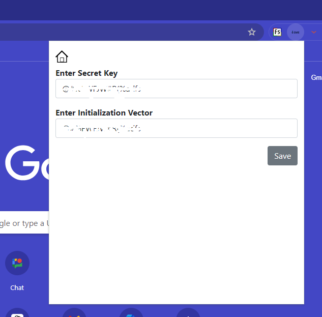

# Encryption and Decryption Tool Extension

## Overview
The Encryption and Decryption Tool Extension is a robust security tool designed to help you securely encrypt and decrypt text or JSON data. Users can set a secret key, encrypt/decrypt content, and easily copy the encrypted/decrypted text.

## Key Features
- **Set Secret Key**: Define a custom secret key for encryption and decryption.
- **Encrypt/Decrypt Content**: Securely encrypt or decrypt text or JSON data.
- **Copy Functionality**: Quickly copy the encrypted or decrypted text to the clipboard.

# Chrome Extension Installation Guide
Follow these steps to add the extension to your Chrome browser:

## Prerequisites
- Ensure you have Google Chrome installed on your machine.

**Open Chrome Extensions Page**
   - Open Google Chrome and navigate to: `chrome://extensions/`

**Enable Developer Mode**
   - Enable Developer mode by toggling the switch located at the top right corner of the page.

**Load the Extension**
   - Click the `Load unpacked` button on the top left of the extensions page.
   - In the dialog that appears, select the `sme-decryption-v2` folder from the cloned/downloaded repository.

## Final Step
- The extension will be added to your browser and is ready to use!
---
